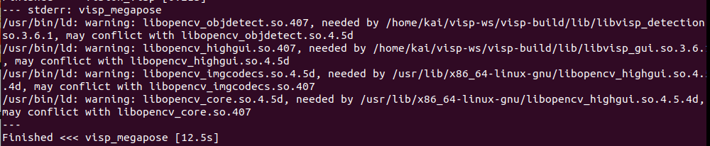
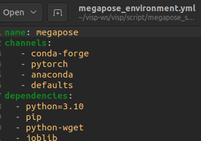
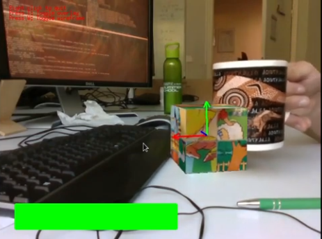
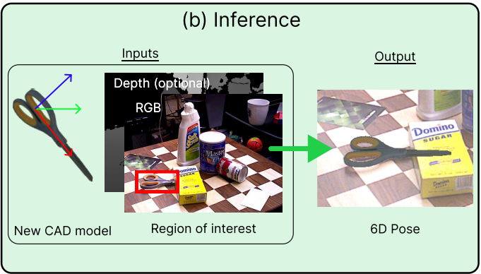

# visp_megapose introduction

MegaPose is a deep learning-based method to estimate the 6D pose of novel objects, meaning that it does not require training for a specific object. MegaPose is a multistage method and can be used either as a full pose estimation algorithm or as a tracker. MegaPose works by render and compare: a synthetized view of an object is compared with a real-world image to see if the poses match. Behind the scene, there are two main models:

The coarse model: given an image, multiple synthetic view are compared with the "true" object image and a model outputs the probability of a render corresponding to the same object as the true image. This model requires the object to be detected (bounding box) in the image.
The refiner model: Given an initial pose estimate, this model predicts a pose displacement to best align render and true image. It is called iteratively, for a fixed number of iterations.

To know more about MegaPose see https://megapose6d.github.io/.
## Hardware & Software Version

This is my test equipment:

- Operating System
	- Ubuntu 22.04
- ROS
	- ROS2 humble
- GPU
	- RTX 2080ti with 12GB VRAM 
	
		Your GPU VRAM must be bigger than 9GB due to [Out of memory issue while running megapose6d #53](https://github.com/megapose6d/megapose6d/issues/53)
	- CUDA 11.3
	- cuDNN 8.5.0
- Camera
	- Realsense D435
## Third-Party Denpendence  

Please refer to the official tutorial [
Tutorial: Tracking with MegaPose](https://visp-doc.inria.fr/doxygen/visp-daily/tutorial-tracking-megapose.html) to install the following third-party packages.

The following third-party packages are recommended to be installed from source code:
- ViSP 3.6.0
- OpenCV 4.7.0 (GPU version) 

	⚠️There may be a conflict with ROS2's OpenCV. Please follow the official  [tutorial](https://visp-doc.inria.fr/doxygen/visp-daily/tutorial-detection-dnn.html) to remove the version installed by ROS2.

	
- nlohmann-json3

- Anaconda

⚠️ When following the official tutorial, please change the official Anaconda setting config "megapose_environment.yml" from Python 3.9 to 3.10, or you won't be able to activate the ROS2 version of the MegaPose server. (If you are using ROS2 Foxy, change the Python version to 3.8).

## Preparing

Before running visp_megapose, make sure you can reproduce the MegaPose result.

## Architecture

The visp_megapose server provides 3 services:

1. Initial Pose Service:

	 Input the bounding box and camera image; the MegaPose server will return a pose. Initial pose estimation takes around 2-4 seconds on an Nvidia RTX 2080ti.

2. Tracking Pose Service:

	Input the previous pose and current camera image; the MegaPose server will return the current pose. On the same setup, a pose update (refinement) iteration takes around 60-70 milliseconds.

3. Render Object Service:

	Input the pose, and the MegaPose server will return a rendered image to verify the correctness of the MegaPose pose.

The visp_megapose client provides 2 ways to supply the bounding box:
1. Using the OpenCV DNN module with YOLOv7.

	(If you want to use another version of YOLO, please refer to the [Tutorial: Deep learning object detection](https://visp-doc.inria.fr/doxygen/visp-daily/tutorial-detection-dnn.html))

2. Clicking on the debug window.

## ROS2 Denpendence

- transforms3d

The fellowing ROS2 Denpendence recommand install by source code.
- cv_bridge 
- visp_bridge

## install visp_megapose

1. Download the vision_opencv and vision_visp rolling version:

	$ cd path/to/your/workspace/src

	$ git clone https://github.com/ros-perception/vision_opencv.git

	$ git clone https://github.com/lagadic/vision_visp.git

2. Compile cv_bridge and visp_bridge:

	$ cd ..

	$ colcon build --packages-select cv_bridge 

	$ colcon build --packages-select  visp_bridge

3. Install transforms3d:

	$ conda activate megapose

	(megapose) $ pip3 install transforms3d

4. Compile visp_megapose:

	(megapose)$ colcon build --packages-select visp_megapose

	(megapose)$ source install/setup.bash

5. Copy the MegaPose config:

	$ cp  path/to/your/workspace/src/vision_visp/visp_megapose/script $VISP_WS/visp/script/megapose_server/megapose_variables_final.json

## Running visp_megapose Demo

1. Download the bag file 

https://drive.google.com/file/d/19j8EUod1O1bmtc549R-V6tZ8BN8O80-c/view?usp=sharing

	$ unzip visp_megapose_bag.zip

2. Play the ROS2 bag file:

	$ ros2 bag play megapose_bag/subset

3. Run the visp_megapose Demo:

	(megapose) $ ros2 launch visp_megapose megapose_server.launch

	(megapose) $ ros2 launch visp_megapose megapose_client.launch

If your detector_method is "DNN".

If your detector_method is "CLICK".

## Future work

MegaPose can use RGB-D images to get a 6D pose, not only RGB. Future updates will integrate visp_megapose more closely.

